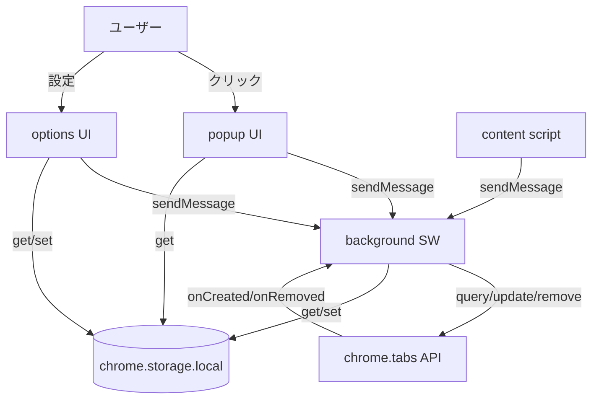
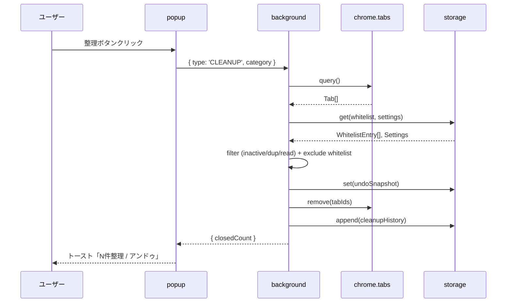
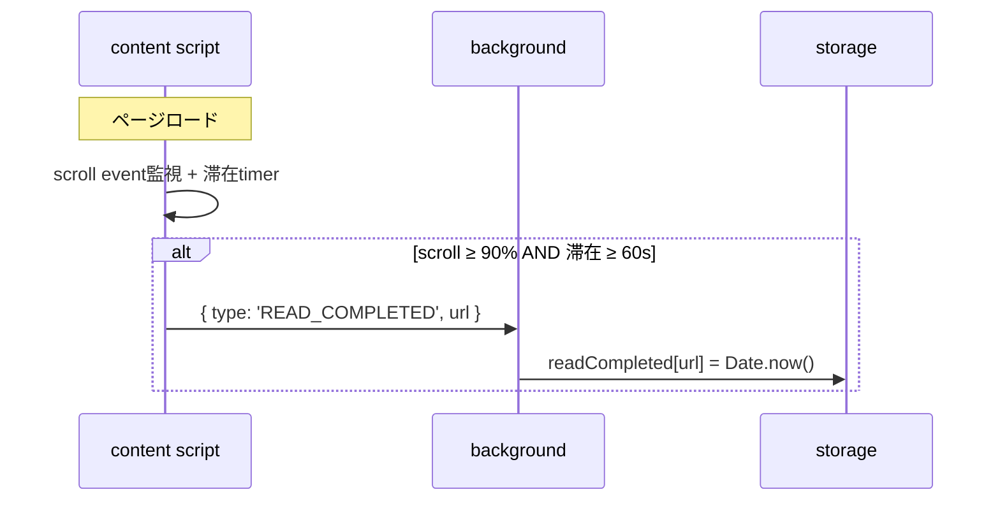
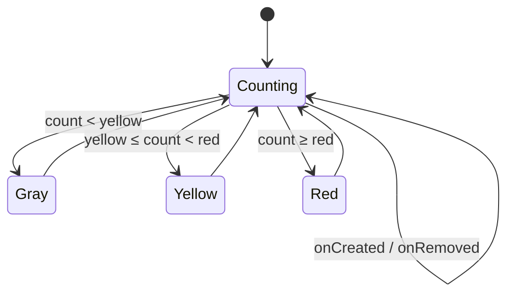

# tab-coach SPEC

## ゴール
タブ過多を可視化 + ワンクリック整理 + 完全オフライン

## 機能一覧
1. タブ数バッジ表示 (灰<10, 黄10-19, 赤20+、閾値カスタム可)
2. 30分以上未アクティブなタブ検出 (lastAccessed 基準)
3. 同ドメイン重複タブ検出 (hostname 一致)
4. 読了タブ検出 (content script で scroll 90% + 1分滞在)
5. ワンクリック整理 (該当タブ一括 close)
6. 30秒以内アンドゥ (storage に閉じる前スナップショット)
7. ホワイトリスト (URL パターンマッチで整理対象外)
8. カスタム閾値 (バッジ色境界 + 未アクティブ判定時間)
9. アーカイブ機能 (close 代わりに storage 保存、後で復元可)
10. 月次レポート (整理回数・節約時間推定)

## 技術スタック (固定)
- Manifest V3
- TypeScript strict
- Vite
- chrome.storage.local (sync は使わない)
- chrome.i18n (ja/en)
- vitest + jsdom

## 命名規則
- ファイル: kebab-case
- 関数: camelCase
- 型: PascalCase
- 定数: SCREAMING_SNAKE

## 型設計 (詳細)

### TabSnapshot
タブの状態スナップショット。アンカ/アーカイブ用。
```ts
type TabSnapshot = {
  id: number;              // chrome.tabs.Tab.id (復元時は新規割当)
  url: string;             // 完全URL
  title: string;           // タブタイトル
  favIconUrl?: string;     // ファビコン URL (なければ undefined)
  lastAccessed: number;    // Unix epoch ms
  windowId?: number;       // 元のウィンドウ ID
  pinned?: boolean;        // ピン留め状態
};
```

### WhitelistEntry
整理対象外にする URL パターン。
```ts
type WhitelistEntry = {
  pattern: string;         // glob風パターン (例: "https://*.github.com/*")
  createdAt: number;       // Unix epoch ms
  note?: string;           // ユーザーメモ
};
```

### Settings
ユーザー設定。
```ts
type Settings = {
  tabLimitYellow: number;       // バッジ黄色閾値 (default: 10)
  tabLimitRed: number;          // バッジ赤色閾値 (default: 20)
  inactiveMinutes: number;      // 未アクティブ判定分数 (default: 30)
  darkMode: 'auto' | 'light' | 'dark';
  fontScale: number;            // 1.0 = 標準
  highContrast: boolean;
};
```

### ArchivedTab
アーカイブ済タブ。
```ts
type ArchivedTab = TabSnapshot & {
  archivedAt: number;      // Unix epoch ms
};
```

### CleanupRecord
整理実行履歴 (月次レポート用)。
```ts
type CleanupRecord = {
  at: number;              // Unix epoch ms
  closedCount: number;     // 閉じたタブ数
  category: 'inactive' | 'duplicate' | 'read' | 'manual';
};
```

### UndoSnapshot
直近の整理スナップショット (30秒以内)。
```ts
type UndoSnapshot = {
  at: number;              // 整理実行時刻
  tabs: TabSnapshot[];     // 復元対象タブ
  expiresAt: number;       // at + 30000
};
```

### StorageSchema
chrome.storage.local の全キー定義。
```ts
type StorageSchema = {
  settings: Settings;
  whitelist: WhitelistEntry[];
  archive: ArchivedTab[];
  cleanupHistory: CleanupRecord[];
  undoSnapshot: UndoSnapshot | null;
  readCompleted: Record<string, number>;  // url -> lastReadAt
};
```

## ディレクトリ構成
- src/background/ (service worker)
- src/popup/ (popup HTML + TS)
- src/options/ (options HTML + TS)
- src/content/ (content script)
- src/lib/ (storage, i18n, logger, tabs, whitelist)
- src/types/ (共通型)
- _locales/ja/ , _locales/en/
- icons/
- tests/
- docs/
- legal/

## データフロー

### 全体構成


### タブ整理フロー


### 読了検出フロー


### バッジ更新フロー


## 触ってはいけない
- 外部 API 呼び出し一切なし (完全オフライン)
- host_permissions なし
- permissions は activeTab + tabs + storage のみ
- chrome.storage.sync 禁止 (.local のみ)
- 独自判断で技術スタック変更禁止

## 完了条件 (Phase 6 完了時)
- npm run build OK (vite)
- npm run lint OK (tsc --noEmit + eslint)
- npm run test OK (vitest)
- release/tab-coach.zip 生成済
- Chrome Web Store に申請済 (Pending review or Published)

## 禁止事項
- 仕様の勝手な追加・変更
- ライブラリの勝手な追加 (devDependencies 以外)
- リファクタの暴走
- 「とりあえず動く版、後で直す」発想
