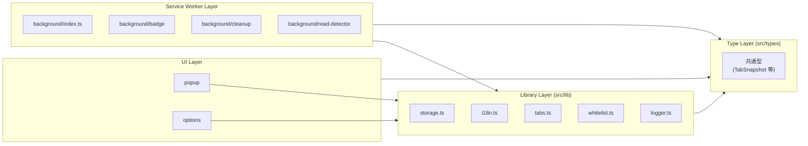
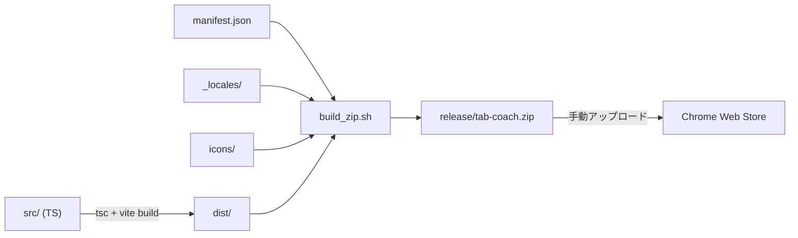

# tab-coach Architecture

本ドキュメントは tab-coach Chrome 拡張の構成を Mermaid 図で示す。
詳細な型定義・データフローは [SPEC.md](../SPEC.md) を参照。

## 1. コンポーネント構成

```mermaid
graph TB
  subgraph Browser["Chrome Browser"]
    direction TB
    User((ユーザー))
    subgraph Extension["tab-coach 拡張"]
      Popup["popup UI<br/>(src/popup)"]
      Options["options UI<br/>(src/options)"]
      BG["background SW<br/>(src/background)"]
      Content["content script<br/>(src/content)"]
    end
    TabsAPI["chrome.tabs API"]
    ActionAPI["chrome.action API<br/>(badge)"]
    I18nAPI["chrome.i18n API"]
    Storage[("chrome.storage.local")]
  end

  User -->|アイコンクリック| Popup
  User -->|右クリック → 設定| Options
  User -->|Web ページ閲覧| Content

  Popup -->|sendMessage| BG
  Options -->|sendMessage| BG
  Content -->|sendMessage| BG

  BG -->|query / update / remove| TabsAPI
  BG -->|setBadgeText / Color| ActionAPI
  BG -->|get / set| Storage

  Popup -->|getMessage| I18nAPI
  Options -->|getMessage| I18nAPI

  Popup -->|get (read-only)| Storage
  Options -->|get / set| Storage

  TabsAPI -->|onCreated / onRemoved / onUpdated| BG
```

## 2. レイヤリング



## 3. ビルドパイプライン



## 4. 主要シーケンス

詳細は [SPEC.md - データフロー](../SPEC.md#データフロー) を参照。

- タブ整理フロー (popup → background → tabs API → storage)
- 読了検出フロー (content script → background → storage)
- バッジ更新フロー (tabs.onCreated / onRemoved → action API)

## 5. 権限スコープ

| 権限         | 用途                                         |
| ------------ | -------------------------------------------- |
| `activeTab`  | アクティブタブへの限定的アクセス             |
| `tabs`       | 全タブ列挙 / lastAccessed 取得 / close       |
| `storage`    | 設定・アーカイブ・履歴の永続化 (local のみ) |

`host_permissions` は **設定しない** (完全オフライン拡張のため)。

## 6. 設計原則

- **完全オフライン**: 外部 API への通信は一切行わない。
- **最小権限**: 上記 3 つの permission 以外は追加しない。
- **個人データ不取得**: URL/タイトルはローカル保存のみ、外部送信なし。
- **同期ストレージ不使用**: `chrome.storage.sync` ではなく `chrome.storage.local` のみ。
- **広告なし**: 収益化はストア課金 (将来の Premium 想定) のみ。
